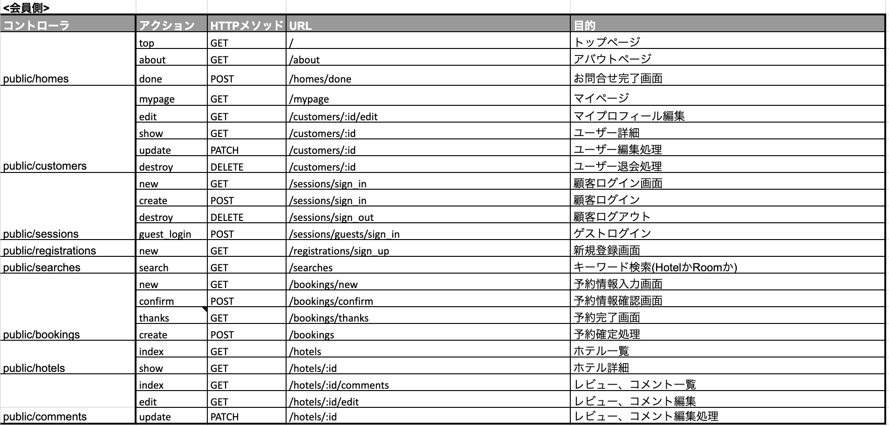
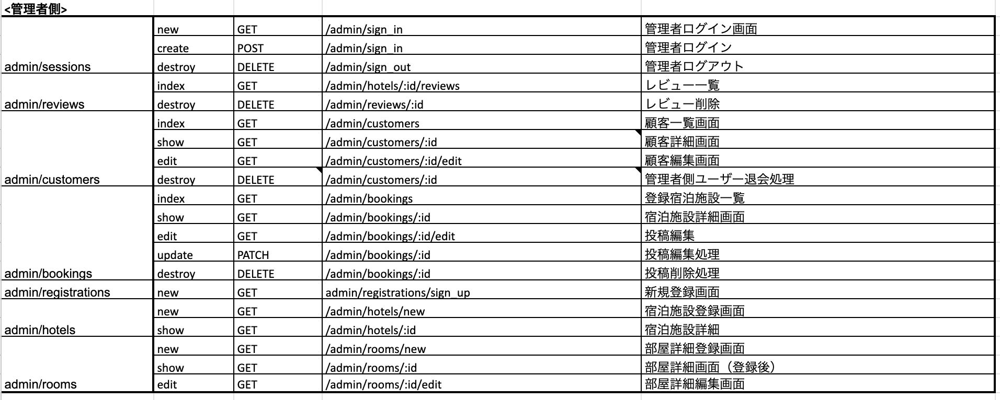
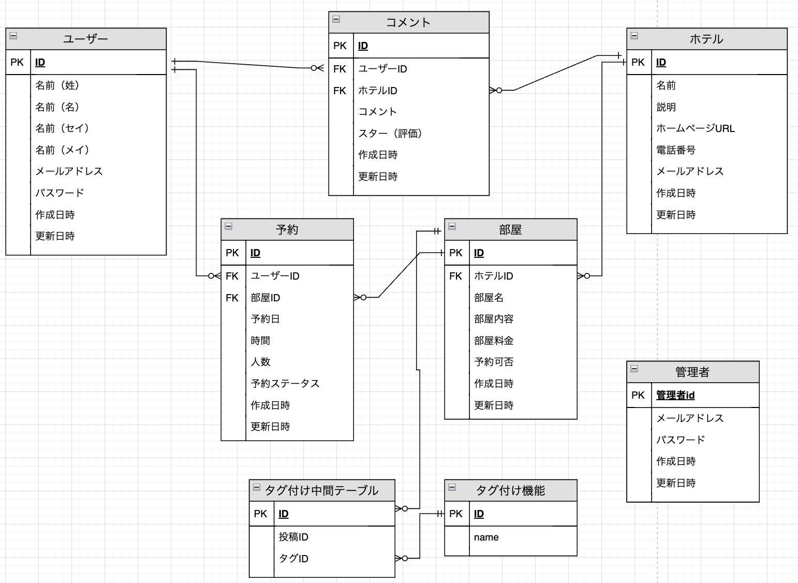

# cancel matching

[cancel matchingサイト](http://3.112.41.195/) 

​
## サイト概要
### サイトテーマ
間近でキャンセルになってしまったホテルと予約を探しているお客様の両者をマッチングさせる予約サイト
​
### テーマを選んだ理由
間近で予約キャンセルになってしまい埋めることができず困っているというホテルの方のお話を聞きました。 
他にも、[このような悪質なキャンセル](https://hotel.ymsch.jp/column/cat/no-show.html)があることも知りました。 
ホテル側が利益を得ることが出来ない状況を改善したいと思い、より１部屋でも空き部屋が減っていけるようにできる様な予約情報サイトを制作したいと考え、このテーマにしました。
​
### ターゲットユーザ
 - 直近で空室のホテルを探しているお客様
 - 予約キャンセルになってしまったお部屋を他のお客様に宿泊してほしいホテル業者
 - ホテルのレビューを知りたいお客様
​
### 主な利用シーン
 - 直近で空室のホテルを探したい時
 - 直前割でお値打ち価格でホテルに宿泊したい時
 - 予約キャンセルになってしまったお部屋を他のお客様に宿泊してほしい時（ホテル業者側）
​
## 設計書

 

## ER図

​
## 開発環境
- OS：Linux(CentOS)
- 言語：HTML,CSS,JavaScript,Ruby,SQL
- フレームワーク：Ruby on Rails
- JSライブラリ：jQuery
- IDE：Cloud9
​
## 使用素材
- フリーイラスト素材として以下を使用
  - [Pexels](https://www.pexels.com/ja-jp/)
  - [Adobe Stock](https://stock.adobe.com/jp/)
  - [Unsplash](https://unsplash.com/ja)